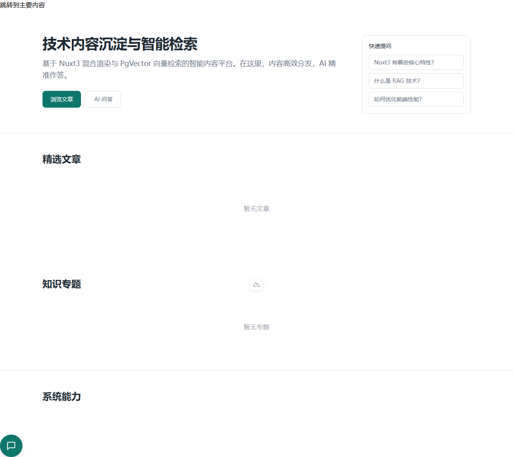
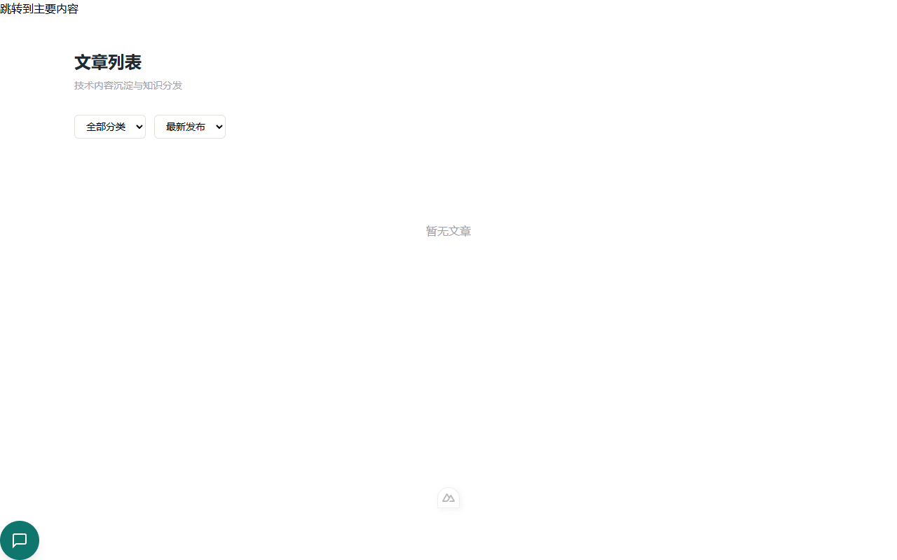
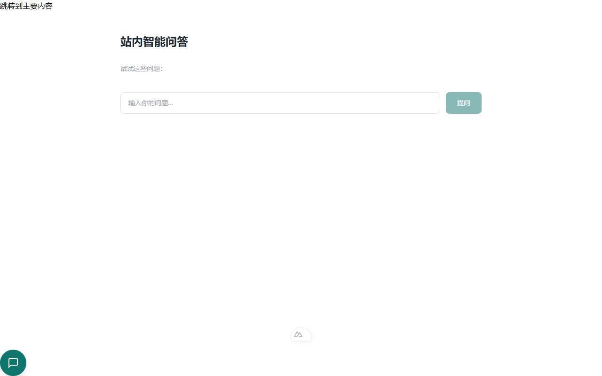
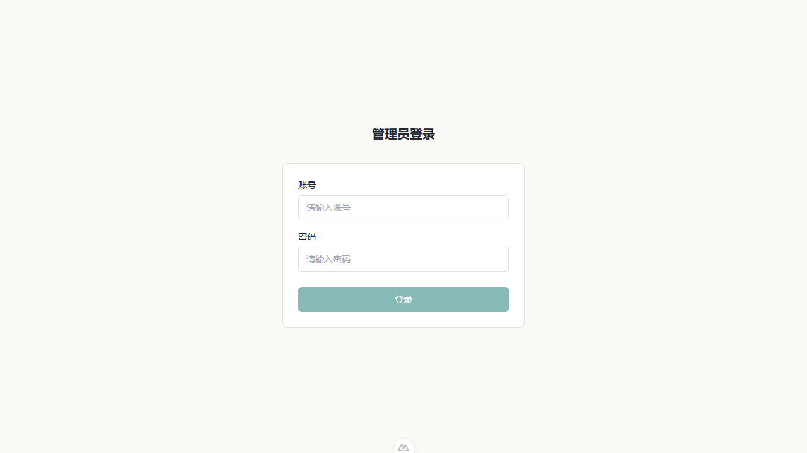

# 智能内容平台

基于 **Nuxt3 混合渲染 + PgVector 向量检索** 的智能内容服务平台，融合内容分发、RAG 智能问答、前端监控与运营管理能力。

## 核心亮点

- **混合渲染**：SSG/SSR/CSR 按页面价值差异化渲染，首屏性能与 SEO 兼顾
- **RAG 智能问答**：站内私有知识库驱动，BGE Embedding + pgvector 向量检索 + LLM 生成回答，引用来源可追溯
- **前端监控 SDK**：自研埋点体系，覆盖 PV/WebVitals/JS异常/资源错误，事件队列批量上报
- **轻量化运营**：单管理员 JWT 鉴权，内容 CRUD、Markdown 编辑器、数据可视化大盘、知识库运维
- **标准化交付**：Docker Compose 一键部署，前后端独立容器，PostgreSQL + Redis 数据持久化

## 技术栈

| 层级 | 技术 |
|------|------|
| 前端渲染 | Nuxt3 + Vue3 + TypeScript + TailwindCSS + Pinia |
| 后端 API | FastAPI (Python 3.12+) + SQLAlchemy 2.0 async |
| 数据库 | PostgreSQL 16 + pgvector 插件 |
| 缓存 | Redis |
| AI 能力 | BGE-small-zh-v1.5 Embedding + OpenAI-compatible LLM API |
| 前端监控 | 自研 Monitor SDK (web-vitals + IntersectionObserver + sendBeacon) |
| 部署 | Docker + Docker Compose |
| 测试 | pytest (后端 104 tests) + Vitest (前端 24 tests) + Playwright E2E |

## 项目架构

```
┌─ 前端渲染层 (Nuxt3) ────────────────────────────┐
│  SSG: 首页/列表/专题   SSR: 文章详情              │
│  CSR: 管理后台/RAG/搜索                          │
│  Monitor SDK: 性能/异常/行为采集                  │
├─ 后端 API/AI 层 (FastAPI) ──────────────────────┤
│  REST API: 内容CRUD/鉴权/监控                    │
│  RAG: 文本清洗→切片→向量化→检索→生成              │
├─ 数据层 ───────────────────────────────────────┤
│  PostgreSQL + pgvector + Redis                   │
├─ 容器运维层 ────────────────────────────────────┤
│  Docker Compose: web/db/redis/backend            │
└────────────────────────────────────────────────┘
```

## 页面截图

| 首页 | 文章列表 |
|------|---------|
|  |  |

| RAG 问答 | 管理后台 |
|------|---------|
|  |  |

## 快速开始

### Docker Compose 一键启动（推荐）

```bash
# 启动所有服务
docker compose up -d

# 初始化数据库表
docker compose exec backend alembic upgrade head

# 写入种子数据
docker compose exec backend python scripts/seed_db.py

# 访问
# 前台: http://localhost:3000
# 后台: http://localhost:3000/admin/login
# API文档: http://localhost:8000/docs
```

### 本地开发

**后端：**

```bash
cd backend
cp .env.example .env          # 编辑数据库连接等配置
pip install -e ".[dev]"
alembic upgrade head           # 初始化数据库
python scripts/seed_db.py      # 写入种子数据
uvicorn app.main:app --reload  # 启动 API 服务 (端口8000)
```

**前端：**

```bash
cd frontend
cp .env.example .env           # 配置后端 API 地址
npm install
npm run dev                    # 启动前端 (端口3000)
```

### 运行测试

```bash
# 后端单元测试 (104 tests)
cd backend && pytest tests/ -v

# 前端单元测试 (24 tests)
cd frontend && npx vitest run

# 前端类型检查
cd frontend && npx nuxt typecheck

# E2E 测试 (需要前后端同时运行)
cd frontend && npx playwright test
```

## API 接口 (49 endpoints)

| 分组 | 主要接口 |
|------|---------|
| **前台开放** | `GET /api/v1/public/home` `GET /articles` `GET /articles/{slug}` `GET /search` |
| **后台管理** | `POST /admin/login` `CRUD /admin/articles` `GET /dashboard/*` |
| **RAG 问答** | `POST /api/v1/rag/ask` `GET /rag/suggestions` |
| **监控** | `POST /api/v1/monitor/report` `GET /monitor/stats` |

完整文档：启动后端后访问 `http://localhost:8000/docs`

## 数据库

8 张核心表：`admin` · `category` · `tag` · `article` · `article_tag` · `comment` · `monitor_log` · `vector_chunk`

ORM 模型：[backend/app/models/](backend/app/models/) | 迁移脚本：[backend/alembic/versions/](backend/alembic/versions/)

## 项目结构

```
├── frontend/          # Nuxt3 前端
│   ├── pages/         # 页面 (前台/后台)
│   ├── components/    # 组件 (article/layout/rag/common)
│   ├── composables/   # API 请求封装
│   ├── stores/        # Pinia 状态管理
│   ├── plugins/       # 监控 SDK
│   └── styles/        # 设计 Token + 全局样式
├── backend/           # FastAPI 后端
│   ├── app/
│   │   ├── routers/   # API 路由 (public/admin/rag/monitor)
│   │   ├── services/  # 业务逻辑 + RAG 管道
│   │   ├── models/    # SQLAlchemy ORM 模型
│   │   ├── schemas/   # Pydantic 请求/响应模型
│   │   ├── middleware/ # CORS/限流/异常
│   │   └── core/      # 配置/安全/数据库/Redis
│   ├── tests/         # 后端测试
│   └── alembic/       # 数据库迁移
├── docs/              # 开发文档
└── docker-compose.yml # 容器编排
```

## 文档

- [开发文档总览](docs/README.md)
- [项目架构与总体方案](docs/基于混合渲染与PgVector向量检索的智能内容服务平台%20-%20企业级开发文档.md)
- [API 接口规范](docs/backend/API接口规范-V1.0.md)
- [数据库设计](docs/backend/数据库设计详细文档-V1.0.md)
- [后端开发规范](docs/backend/后端开发规范-V1.0.md)
- [前端设计规范](docs/frontend/前端设计规范-V1.0.md)
- [前端组件规范](docs/frontend/前端组件规范-V1.0.md)

## 测试

| 测试集 | 数量 | 框架 |
|--------|------|------|
| 后端测试 | 104 | pytest |
| 前端单元测试 | 24 | Vitest |
| 前端 E2E | 9 | Playwright |
| **总计** | **137** | |

```bash
cd backend && pytest tests/ -q   # 104 tests
cd frontend && npx vitest run    # 24 tests
cd frontend && npx nuxt typecheck # 0 errors
```

## 前端组件 (21)

**通用组件**: Skeleton · BaseButton · FormField · Pagination · DataTable · MetricCard · StatusBadge · BackToTop

**业务组件**: ArticleCard · ArticleProgress · ArticleToc · CopyCodeButton · RelatedArticles · CommentSection · CommentForm · TrendChart · RAGFloatingButton

**布局组件**: SiteHeader · SiteFooter · AdminSidebar · AdminTopbar

## License

MIT
